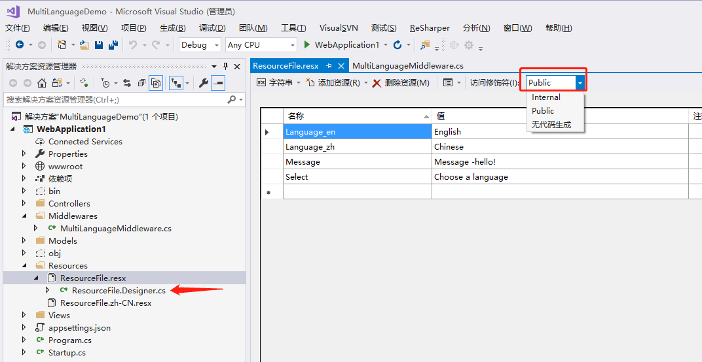
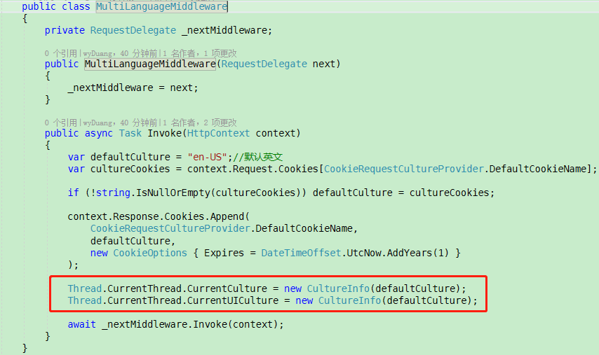
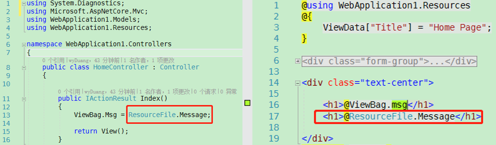

# MultiLanguageDemo
.Net Core制作的多语言切换网站Demo，不同于官方实例，每种语言只有一个资源文件。

>其实ASP.NET Core中官方提供了Microsoft.AspNetCore.Localization库来实现本地化。<br>参考官方文档：https://docs.microsoft.com/zh-cn/aspnet/core/fundamentals/localization?view=aspnetcore-2.2

但按照官方写法，每个控制每个视图都要建一个资源文件，这样语种多了，工作量暴增，
所以想到使用自定义中间件来更改主线程的`CurrentCulture`和`CurrentUICulture`属性为特定语言，
即可实现`.resx`资源文件的全局利用。

## 步骤：
#### 1.首先添加相应语言的资源文件，由于`.resx`资源文件默认是`Internal`访问级别的，这会导致其它程序集无法访问资源文件类，所以所以我们需要将默认语种的`.resx`资源文件访问级别改成`Public`。
#### 图一：
 

以图一为例，设置`ResourceFile.resx`的访问级别为`Public`后，会生成`ResourceFile.Designer.cs`文件。点开可以看到此文件的命名空间是`WebApplication1.Resources`。

#### 2.再添加自定义中间件 `MultiLanguageMiddleware.cs`：
#### 图二：
 

在.NET Core中.resx资源文件是和线程的语言相关，其主要和当前线程的如下两个语言属性相关：

*Thread.CurrentThread.CurrentCulture \<br>
*Thread.CurrentThread.CurrentUICulture

如果当前线程的这两个属性是什么语言，那么.resx资源文件就会返回对应语言的内容。

```C#
Thread.CurrentThread.CurrentCulture = new CultureInfo("zh-CN");
Thread.CurrentThread.CurrentUICulture = new CultureInfo("zh-CN");
```

#### 3.然后再控制器中或视图中，`using WebApplication1.Resources;` 后就可以直接调用了。
#### 图三：
 

>附加：官方文档中ASP.NET Core的本地化中间件默认支持3种语言文化提供器,demo中我使用的Cookie.<br>
*URL中的查询字符串<br>
*Cookie<br>
*请求头
